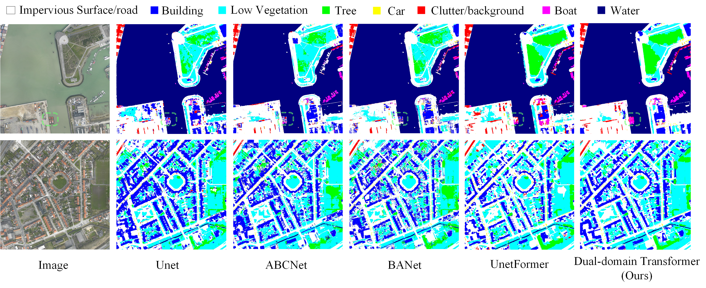

# Dual-domain-Transformer
<div align="center">

<h1>Boundary-aware Spatial and Frequency Dual-domain Transformer for Remote Sensing Urban Images Segmentation</h1>

<div>
    Jie Zhang</a><sup>1,2</sup>&emsp;
    Mingwen Shao</a><sup>*1</sup>&emsp;
    Yecong Wan</a><sup>1</sup>&emsp;
    Lingzhuang Meng</a><sup>1</sup>&emsp;
    Xiangyong Cao</a><sup>3</sup>&emsp;
    Shuigen Wang</a><sup>4</sup>&emsp;
</div>
<div>
    <sup>1</sup>China University of Petroleum, Qingdao&emsp;
    <sup>2</sup>Qingdao University of Technology&emsp;
    <sup>3</sup>Xi’an Jiaotong University&emsp;
    <sup>4</sup>Yantai Iray Technology Co. Ltdy&emsp;
</div>



(a) The visualization of the feature map in the encoder's final layer. Colors represent normalized pixel values, with red regions indicating high network attention. From left to right, it shows the original image, the feature map from the spatial-domain method (hybrid CNN-ViT\cite{ref30}), the feature map from our implementation of the FFT following the architecture outlined in \cite{ref14}), and the feature map from our method. (b) The Ground Truth (GT) and the segmentation results corresponding to the different methods in (a). The analysis illustrates that the spatial-domain and frequency-domain methods are complementary for feature extraction, with segmentation more accurate in areas receiving high attention. Our method leverages both domains to jointly extract features, capturing more comprehensive features.

</div>

## Abstract
> *Semantic segmentation of Remote Sensing (RS) images refers to labeling each pixel with a class to identify objects or land cover types. Existing mainstream spatial-domain semantic segmentation methods are mainly categorized into Convolutional Neural Network (CNN)-based and Vision Transformer (ViT)-based approaches. The former excels at capturing local features, while the latter is adept at extracting global features. Several recent approaches consider combining CNN and ViT to efficiently capture local and global features. However, these approaches still struggle to capture complete features of the RS images, resulting in inaccurate segmentation. To address this issue, we introduce the Fast Fourier Transform (FFT), which transforms images into the frequency domain for feature extraction, acquiring the image-size receptive field that can complement spatial-domain methods. Based on this, we propose a Boundary-aware spatial and frequency Dual-domain Transformer, termed Dual-domain Transformer. Specifically, our Dual-domain Transformer incorporates a Dual-domain Mixer (DualM), where the spatial-domain branch combines depthwise convolution and the attention mechanism to extract local and global features effectively, while the frequency-domain branch uses FFT to extract image-size features. The two branches complement each other, enabling a more comprehensive feature extraction of RS images. Meanwhile, a boundary-guided training strategy utilizing a Boundary-Aware Module (BAM) is devised to constrain the model extract and predict boundary detail texture, which is an auxiliary task. Additionally, the decoder incorporates a Scale-feature Fusion Module (SFM) for adaptive information fusion between the encoder and decoder. Comprehensive experiments on the Zeebrugge and ISPRS datasets, including Vaihingen and Potsdam, showcase that the Dual-domain Transformer significantly outperforms state-of-the-art (SOTA) methods.*

## Dependencies and Installation


```
# install torch and dependencies
pip install -r requirements.txt
```


## Datasets

We include the following dataset configurations in this repo: 
1) `ISPRS Vaihingen`: https://www.isprs.org/education/benchmarks/UrbanSemLab/
2) `ISPRS Potsdam`: https://www.isprs.org/education/benchmarks/UrbanSemLab/
3) `Zeebrugge`: Campos-Taberner M, Romero-Soriano A, Gatta C, et al. Processing of extremely high-resolution Lidar and RGB data: outcome of the 2015 IEEE GRSS data fusion contest–part a: 2-D contest[J]. IEEE Journal of Selected Topics in Applied Earth Observations and Remote Sensing, 2016, 9(12): 5547-5559.

Data Preprocessing

```
python ./tools/vaihingen_patch_split.py 
python ./tools/potsdam_patch_split.py 
python ./tools/zeebrugge_patch_split.py 
```

## Training
```
python train_supervision.py -c config/<dataset name>/dual_domain_transformer.py
```

## Evaluation
```
python <dataset name>_test.py
```


## Results

<div>

</div>

<div>

</div>

## Citation

```
@article{zhang2024boundary,
  title={Boundary-aware Spatial and Frequency Dual-domain Transformer for Remote Sensing Urban Images Segmentation},
  author={Zhang, Jie and Shao, Mingwen and Wan, Yecong and Meng, Lingzhuang and Cao, Xiangyong and Wang, Shuigen},
  journal={IEEE Transactions on Geoscience and Remote Sensing},
  year={2024},
  publisher={IEEE}
}
```

## Acknowledgement
This implementation is based on [iFormer](https://github.com/sail-sg/iFormer). Thanks for the awesome work.